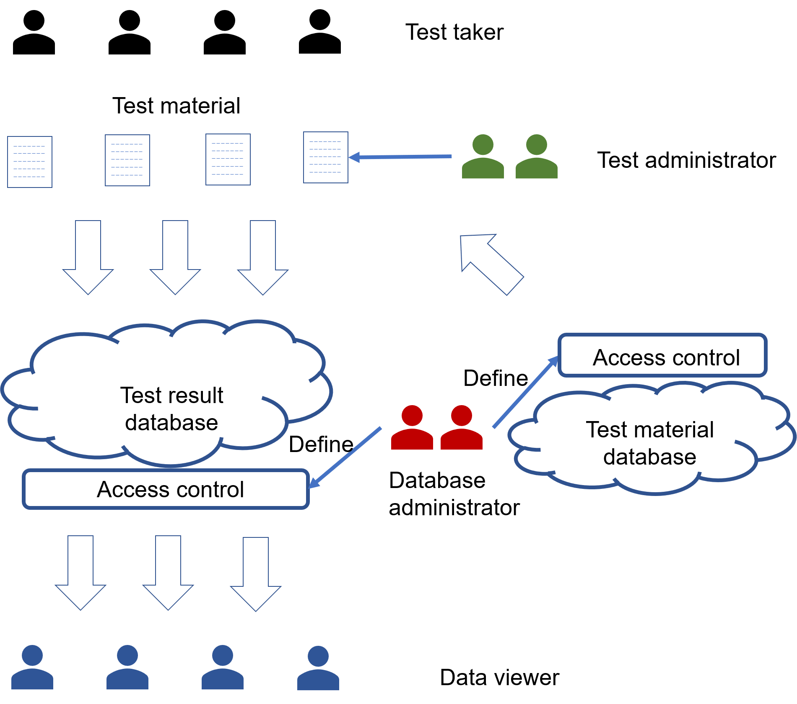
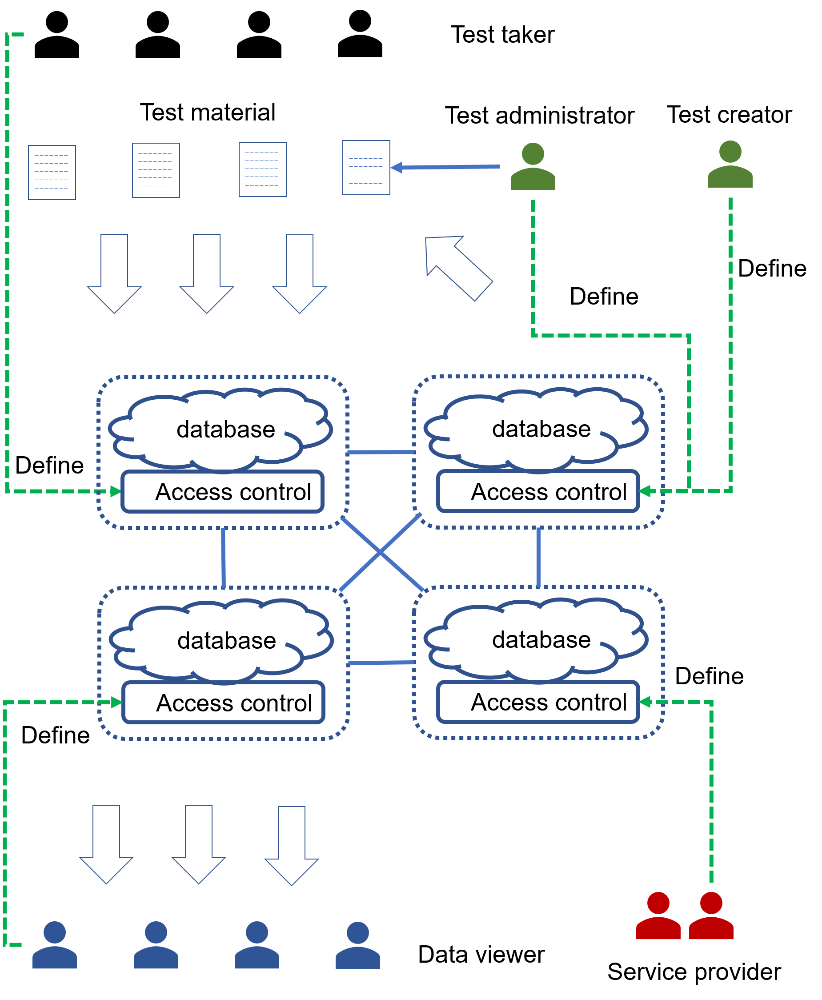
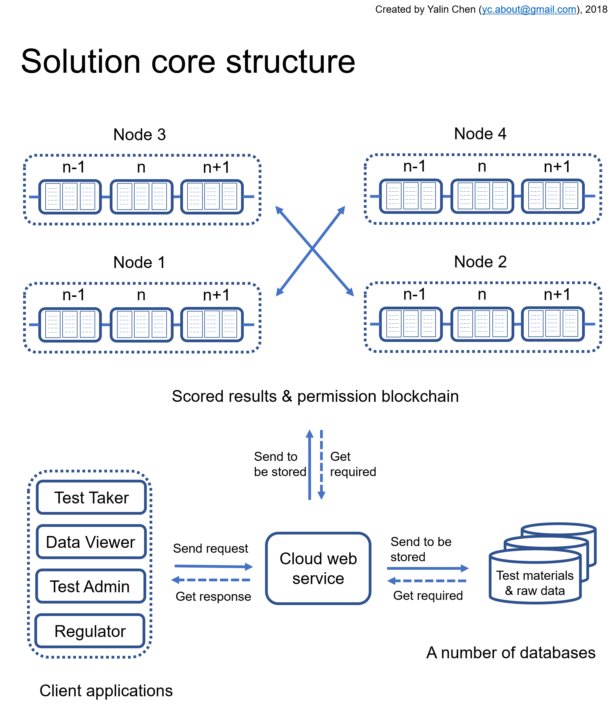

## Note, this is only a code sample containing several sample files. I tried to make it to be representative, but I can not guarantee.

* #### The code sample for the front end, which is mainly based on Reactjs and Redux, is under `reactf` folder. 

* #### The code sample for the web service, which is mainly based on Nodejs and MongoDB, is under `webservice` folder.

* #### The code sample for the blockchain, which is mainly based on Hyperledger Fabric, is under `psytest-blockchain` folder. 

Note that there are relatively more comments in the blockchain module but there are less comments in other modules. This is because blockchain is a new technology and other modules are relatively straightforward.

The full project has around 90 user created code files and is in a private repository.

A brief description for the project is as follows, and the full code can be demonstrated in person.

# psytest
This is a blockchain-based project for psychology test data management. It includes a front end, a web service, and a blockchain component.

* #### The front end component is mainly based on Reactjs and Redux.

* #### The cloud webservice component is mainly based on Nodejs and MongoDB.

* #### The blockchain component is mainly based on Hyperledger Fabric.

All copyrights belongs to the author, at least for now.

#### author: Corey(Yalin) Chen
#### corey.about@gmail.com

## Usually, the traditional psychology test data management systems look like this:

## Using the blockchain technology, the psychology test data management systems could look like this:

## The architecture of the current solution look like this:

